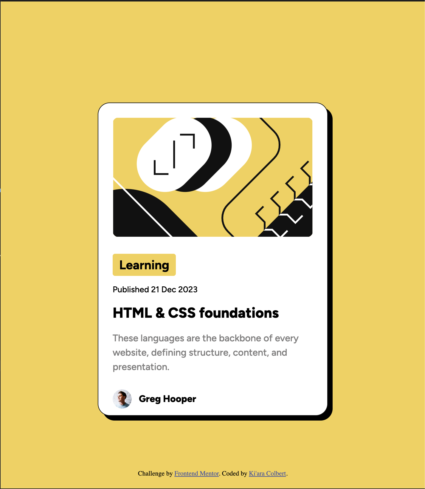

# Frontend Mentor - Blog preview card solution

This is a solution to the [Blog preview card challenge on Frontend Mentor](https://www.frontendmentor.io/challenges/blog-preview-card-ckPaj01IcS). Frontend Mentor challenges help you improve your coding skills by building realistic projects. 

## Table of contents

- [Overview](#overview)
  - [The challenge](#the-challenge)
  - [Screenshot](#screenshot)
  - [Links](#links)
- [My process](#my-process)
  - [Built with](#built-with)
  - [What I learned](#what-i-learned)
  - [Continued development](#continued-development)
- [Author](#author)

## Overview

### The challenge

Users should be able to:

- See hover and focus states for all interactive elements on the page

### Screenshot

### Links

- Solution URL: [View on Frontend Mentor]([https://your-solution-url.com](https://www.frontendmentor.io/solutions/blog-preview-html-css-KdE1vQXuj_))
- Live Site URL: [View via GitHub Pages]([https://your-live-site-url.com](https://kiaraaa123.github.io/blog-preview-frontend-mentor/))

## My process

### Built with

- Semantic HTML5 markup
- CSS custom properties
- Flexbox
- CSS Grid

### What I learned

This challenge helped me better understand how to read design files and use them to help me ensure that the sites I develop are pixel perfect. Even as someone who has used Figma to design, I didn't realize until working on this design just how much information you can obtain from the Figma file.

### Continued development

I will continue improving my ability to read design files and use them as a guide to develop websites exactly as they were designed to be.

## Author

- Website - [Ki'ara Colbert](https://www.kiaracolbert.com)
- LinkedIn - [@kiaramontgomery](https://www.linkedin.com/in/kiaramontgomery/)
- GitHub - [@kiaraaa123](https://github.com/kiaraaa123)
- Frontend Mentor - [@kiaraaa123](https://www.frontendmentor.io/profile/kiaraaa123)
